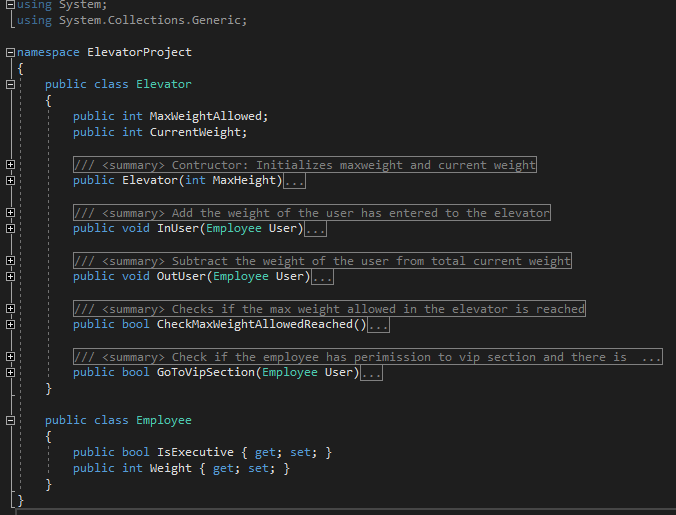
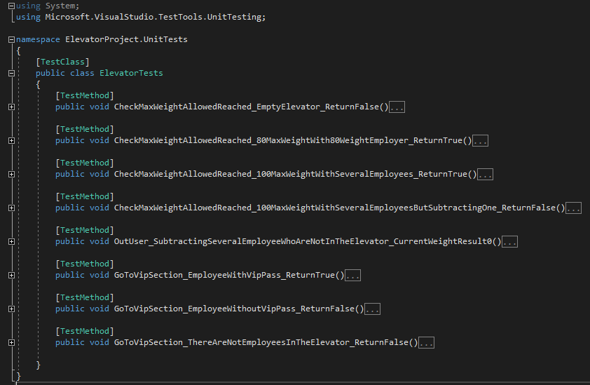
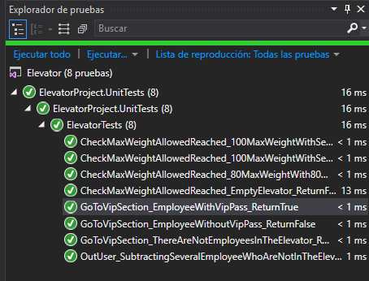

# Unit testing C# example

Example of **Unit Testing** using C# and **Visual Studio 2017**

### Description

Playing with unit tests in a real C# project, it's very interesting, just creating a new project with the purpose to test your main project. But be careful with all actions you want to test, they must be decoupled and available to be executed outside its class.

This solution has two projects:

1. **Elevator** which has the file *Elevator.cs* and the *MainTest.cs*

*Elevator.cs* has a class (Elevator) which controls the max weight allowed inside the elevator and if the user who is inside could go to vip section. And another class *Employee* which manages the weight and if the employee has permission to vip section.

*MainTest.cs* is just for execute the project inside a terminal window.

2. **ElevatorPoject.UnitTests** is where all unit tests are, inside the file *ElevatorTests.cs*

### Installing

Open this project in your Visual Studio 2017 and make sure to open the "Tests explore Window" to execute the unit tests (Test > Windows > Tests Explore) 

## Running the tests

The test project has an archive called *ElevatorTests.cs* there you can see all the test functions which the Unit Test will execute automated. Check them out and feel free to add, modify and play with it.

## License

This project is licensed under the MIT License - see the [LICENSE](LICENSE) file for details
